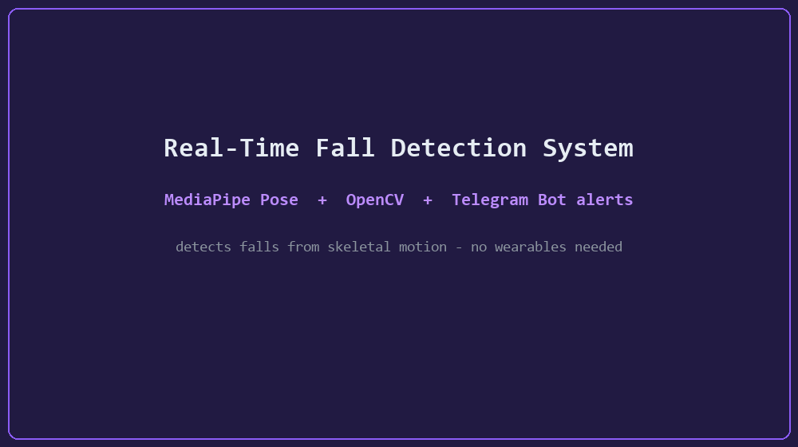

<div align="center">

# 🚨 Real-Time Advanced Fall Detection System


<p align="center">
  <b>An intelligent computer vision system that tracks skeletal keypoints to detect human falls and instantly sends emergency photo alerts via Telegram.</b>
</p>

</div>

---

## 📋 Table of Contents
1. [About The Project](#-about-the-project)
2. [Key Features](#-key-features)
3. [Telegram Bot Setup Guide](#-telegram-bot-setup-guide)
4. [Installation & Running](#-installation--running)
5. [License](#-license)

---

## 📖 About The Project
Traditional fall detection systems rely on simple bounding boxes, which often trigger false alarms due to normal movements like bending down or sitting. This project uses **MediaPipe Pose Estimation** to extract precise skeletal keypoints (shoulders and hips), applying strict mathematical logic and temporal debouncing for high-accuracy fall detection.

---

## ✨ Key Features
* **Mathematical Pose Estimation:** Tracks body keypoints instead of generic object-detection boxes.
* **Smart False-Alarm Prevention:** Uses a continuous frame-buffer threshold to distinguish actual falls from temporary movements.
* **Instant IoT Telegram Alerts:** Automatically captures a snapshot and pushes it to a Telegram chat with an exact timestamp.
* **Cooldown Protection:** Built-in rate-limiting (60-second cooldown) to prevent notification spam.

---

## 🤖 Telegram Bot Setup Guide (Step-by-Step)
To receive alerts on your phone, follow these quick steps:
1. Open Telegram and search for **`@BotFather`**.
2. Send the command `/newbot` and follow the prompts to name your bot.
3. BotFather will provide an **API Token**. Save this as your `TELEGRAM_BOT_TOKEN`.
4. Search for **`@userinfobot`** on Telegram and start a chat to get your numeric **Chat ID**. Save this as your `TELEGRAM_CHAT_ID`.

---

## 🚀 Installation & Running
```bash
# 1. Clone the repository
git clone [https://github.com/hajar-benhadj/fall-detection-system.git](https://github.com/hajar-benhadj/fall-detection-system.git)
cd fall-detection-system

# 2. Install dependencies
pip install opencv-python mediapipe==0.10.14 numpy requests

# 3. Run the application (Make sure to configure your Telegram credentials in fall_detection.py first)
python fall_detection.py

---

## ⭐ Show Your Support

If this project helped you build a safety system or learn pose-based detection, please give it a ⭐ — it helps others discover it!

## 📄 License

Distributed under the MIT License. See [`LICENSE`](LICENSE) for more information.


## 🎬 Demo


